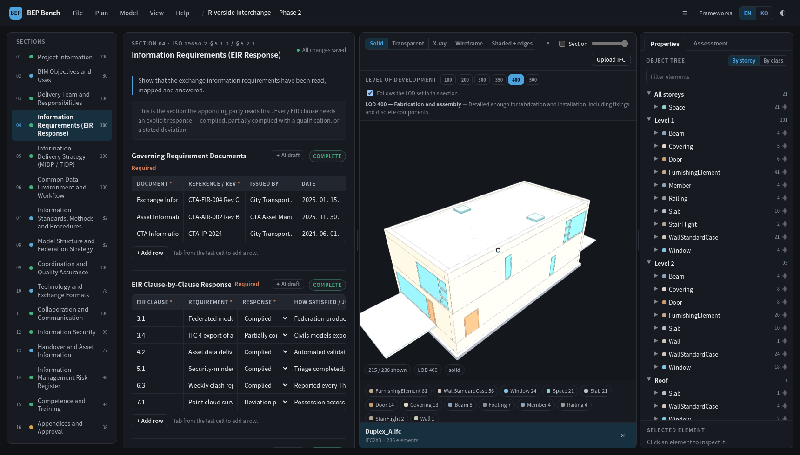
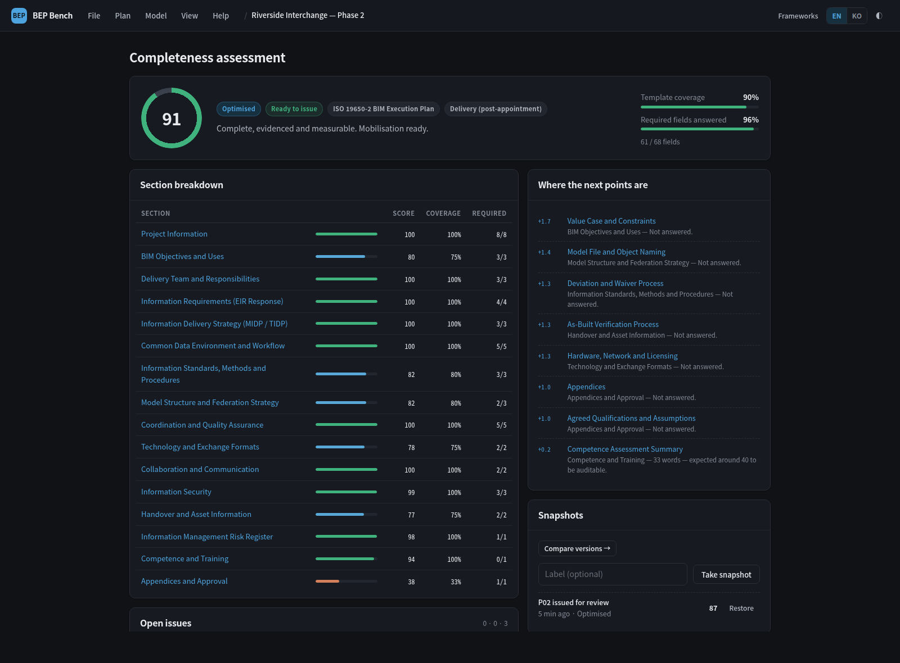
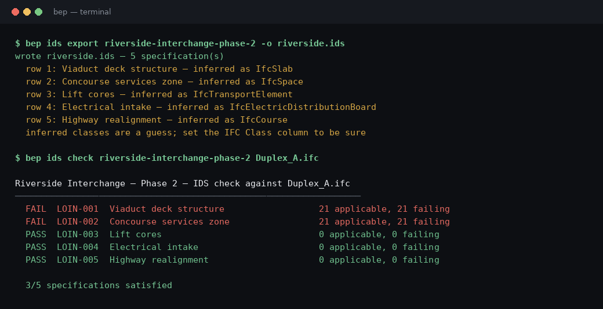
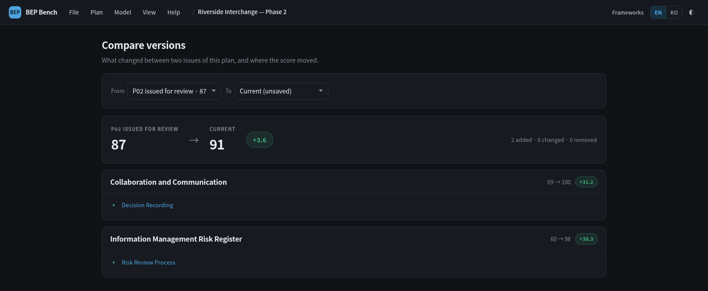
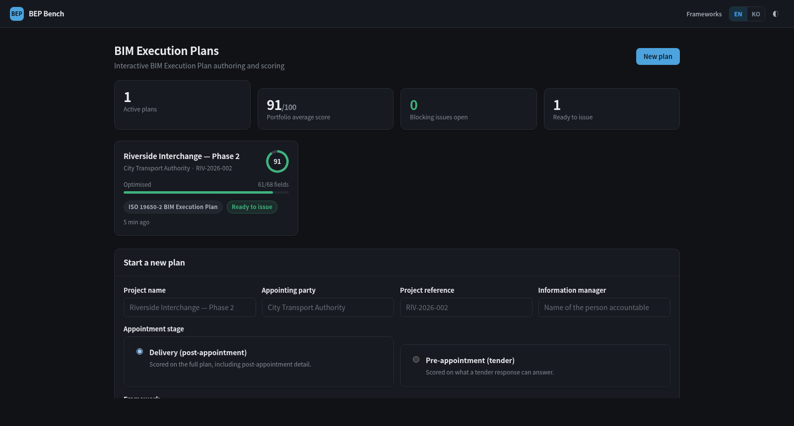

# BEP Bench

**Author, score and export BIM Execution Plans — with the IFC model beside the plan.**

A BEP is usually a Word template that gets filled in, skimmed by a reviewer, and filed.
BEP Bench treats it as structured data that can be **scored**, checked for internal
consistency, drafted with a local model, exported as a **buildingSMART IDS**, and read
side by side with the IFC model it governs.



Everything runs on your own machine. The default model provider is a local Ollama, because
an ISO 19650-5 triage routinely classifies an asset as sensitive — which rules out pasting
the plan into a hosted LLM.

---

## What it does

| | |
| --- | --- |
| **Scores the plan, not the form** | Weighted by the depth each field needs. "TBD" scores near zero. Cross-field checks catch an unowned BIM use or a task team with no TIDP row. |
| **Knows the two ISO 19650-2 stages** | A pre-appointment BEP is not a half-finished delivery BEP, and is not marked down for detail that only exists after the appointment. |
| **Exports buildingSMART IDS** | The LOIN table becomes a machine-checkable IDS 1.0 document, and the attached IFC can be validated against the plan's own requirements. |
| **Compares versions** | What changed between P02 and C01, and which section moved the score. |
| **Puts the model next to the plan** | Upload an IFC and it renders beside the editor, filtered to the LOD the plan itself declares. Select an element and see its properties next to the requirement this plan places on it. |
| **Drafts with a local model** | Per-field Draft / Improve / Expand / Critique through Ollama. Nothing leaves the machine; nothing is saved without a click. |
| **Exports to Word** | A real `.docx` with styled headings, native tables and a TOC field — plus Markdown, HTML and JSON. |
| **Three frameworks, all in YAML** | ISO 19650-2 (16 sections, 69 fields), NBIMS-US v4, and a Lite template. A house standard is a file, not a fork. |
| **English and Korean**, light and dark, full CLI for scripting and CI. | |

### Demo video

**[docs/demo/bepbench-demo.mp4](docs/demo/bepbench-demo.mp4)** — 75 seconds on the public
[Duplex Apartment](docs/demo/Duplex_A.ifc) model (IFC2X3, 236 renderable elements): orbit
and zoom, the five render modes, the LOD sweep, the section plane, the object tree and IFC
property sets, a LOIN row typed into the plan and then read back on a selected door, and
the AI filling two BEP fields while the score moves 87 → 91.

---

## Quick start

```bash
git clone https://github.com/mac999/bepbench.git
cd bepbench
python3 -m venv .venv && source .venv/bin/activate
pip install -e .

bep demo                  # a worked example plan, scored ~87/100
bep score riverside-interchange-phase-2
bep serve                 # http://127.0.0.1:8080
```

Requires **Python 3.11+**. Each extra degrades cleanly if absent — the feature reports why
it is unavailable and everything else keeps working:

```bash
pip install -e ".[ifc]"    # ifcopenshell — IFC upload and the model canvas
pip install -e ".[ids]"    # ifctester    — buildingSMART IDS export and checking
pip install -e ".[docx]"   # python-docx  — Word export
pip install -e ".[all]"    # all of the above
ollama pull qwen3:30b-instruct   # AI drafting (any Ollama model works)
```

To try it on the bundled model:

```bash
bep ifc import riverside-interchange-phase-2 docs/demo/Duplex_A.ifc
bep serve
```

---

## The score

Three numbers, because they answer different questions:

| Metric | Question | Behaviour |
| --- | --- | --- |
| **Coverage** | How much of the template has been touched? | Rises fast. Flatters a draft. |
| **Required coverage** | Are the mandatory commitments answered *fully*? | Only counts fields scoring 1.0. |
| **Score** | Is what is written actually usable? | Weighted by depth. Rises slowly. |

Keeping them apart is what stops box-ticking from reading as progress. A plan can score 80
and still not be issuable: one unowned BIM use is a contractual hole regardless of how well
the rest reads.



Full rules, including what the engine deliberately **cannot** tell you, are in
[docs/03-scoring.md](docs/03-scoring.md).

---

## buildingSMART IDS

The LOIN table states what each element must carry. IDS is the standard that makes such a
statement machine-checkable, so the two are the same information in two forms. Exporting
rather than re-authoring keeps them from drifting apart.



```bash
bep ids export <plan> -o plan.ids          # IDS 1.0, XSD-valid
bep ids check  <plan> model.ifc            # validate a model against the plan
bep ids check  <plan> --fail-on-error      # a CI gate
```

A row that names no IFC class is **reported, never guessed** into a silent false positive;
inference from the element name is a convenience and says so. Set the *IFC Class* column in
the LOIN table to be certain.

---

## Appointment stages

ISO 19650-2 asks for two documents. Scoring a tender response against the delivery plan's
expectations tells the author their plan is incomplete when it is simply early.

```bash
bep new "Riverside Phase 2" -f iso19650 --stage pre_appointment
bep score <plan> --stage delivery    # what it would score as a delivery BEP
```

In the ISO framework 22 of 69 fields are marked delivery-only — TIDPs, mobilisation,
confirmed CDE rules, training. The same answers score **97.8** as a pre-appointment BEP and
**66.6** as a delivery BEP, which is the honest reading of both.

---

## Version comparison



```bash
bep diff <plan>                     # latest snapshot vs current
bep diff <plan> 3 5                 # two snapshots
bep diff <plan> --json              # for scripts
```

Field-level added / changed / removed, with each section's score movement next to it — so a
score change has a cause you can point at.

---

## CLI

```bash
bep frameworks                            # what templates are installed
bep new "Riverside Phase 2" -f iso19650 --stage delivery
bep set <plan> cde_workflow.cde_platform "Autodesk Construction Cloud"
bep set <plan> objectives_uses.bim_goals --from-file goals.md
bep show <plan> --section objectives_uses
bep score <plan>                          # meters, sections, issues, next gaps
bep score <plan> --json                   # the whole report, for scripts
bep score <plan> --require-ready --fail-under 70    # a CI gate
bep assist <plan> risk.risk_process --mode draft --apply
bep ifc import <plan> model.ifc
bep ifc inspect model.ifc
bep ids export <plan> -o plan.ids
bep diff <plan>
bep export <plan> --format docx --out BEP.docx
bep snapshot <plan> --label "Issued for Stage 3"
bep config                                # effective settings and their source
bep --lang ko framework iso19650          # Korean labels in the terminal
```

Every command runs through the same services as the web app, so a plan can be started in
the browser, drafted in the terminal and gated in CI without the three disagreeing about
what "complete" means.



---

## HTTP API

```
GET    /api/frameworks                       GET  /api/projects
POST   /api/projects                         GET  /api/projects/<slug>
PUT    /api/projects/<slug>/values           GET  /api/projects/<slug>/score
POST   /api/projects/<slug>/assist           GET  /api/projects/<slug>/export?format=
GET    /api/projects/<slug>/ids              POST /api/projects/<slug>/ids/check
GET    /api/projects/<slug>/diff             GET  /api/projects/<slug>/models
POST   /api/projects/<slug>/models           GET  /api/projects/<slug>/models/<id>/index
GET    /api/projects/<slug>/models/<id>/buffer
GET    /api/projects/<slug>/models/<id>/elements/<guid>
GET    /api/settings/viewer                  GET  /api/ai/status
```

---

## Configuration

Everything a team might reasonably want to change lives in JSON, not in Python. Defaults
ship in `bepkit/config_files/defaults.json`; overrides are deep-merged from `$BEP_CONFIG`,
`./bep.config.json`, then `<data dir>/config.json`.

```json
{
  "ai":      { "model": "qwen3:8b", "temperature": 0.2 },
  "scoring": { "ready_score": 75 },
  "viewer":  { "lod": { "default": "350" } }
}
```

`bep config` prints what is in force and where it came from. Frameworks are YAML: drop a
file into `bepkit/frameworks/`, or point `BEP_FRAMEWORK_PATH` at your own directory. See
[docs/04-configuration.md](docs/04-configuration.md).

---

## Deployment

```bash
docker build -t bepbench .
docker run -p 8080:8080 -v bep-data:/data -e SECRET_KEY=... bepbench
```

Fly.io config is included (`fly.toml`): a mounted volume at `/data`, a `/healthz` check, and
suspend-when-idle so an occasional-use instance costs close to nothing. Details and sizing
guidance in [docs/05-deployment.md](docs/05-deployment.md).

---

## Layout

```
bepkit/
  schema/        framework definitions: dataclasses, YAML loader, locale overlays
  frameworks/    the templates themselves (+ locales/ for translations)
  scoring/       field rules, cross-field checks, the report
  services/      what the web and CLI both call; nothing else touches the ORM
  ids/           LOIN table -> buildingSMART IDS, and validation against a model
  exporters/     markdown, html, docx
  ai/            provider (Ollama / OpenAI-compatible) and prompt construction
  ifcio/         IFC parsing, tessellation, element properties
  web/           blueprints, templates, static assets (three.js vendored)
  cli/           the bep command
  config_files/  defaults.json — everything configurable
```

## Documentation

| | |
| --- | --- |
| [Research](docs/01-research.md) | The standards, the existing tools, and the gaps this fills |
| [Feature and UX structure](docs/02-ux-structure.md) | Information architecture, panes, menus, flows |
| [Scoring model](docs/03-scoring.md) | How the number is produced, and what it cannot tell you |
| [Configuration](docs/04-configuration.md) | The JSON settings, and writing your own framework |
| [Deployment](docs/05-deployment.md) | Fly.io, Docker, operations |

## Tests

```bash
pip install -e ".[dev]"
pytest -q        # 124 tests
```

Optional-dependency tests skip when the dependency is absent. No test needs a model server
or a network.

## Standards

BS EN ISO 19650-1/-2/-5 · NBIMS-US v4 · Penn State BIM PxP Guide v2.2 · EN 17412-1 ·
BIMForum LOD Specification · buildingSMART IDS 1.0 · IFC2X3 / IFC4

## Licence

MIT
